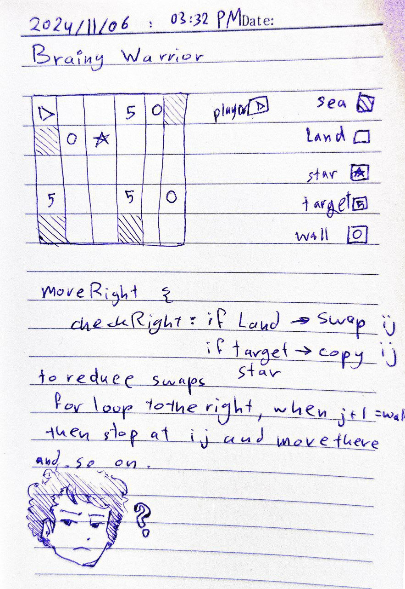

Brainy Warrior
==============

[Brainy Warrior](https://www.coolmathgames.com/0-brainy-warrior) is a puzzle game, the goal of the game is to defeat all enemies, by moving (sliding) towards them, if you don't have an enemy to defeat or a wall to stop you from running, you'll fall right into the water.

**Table of Contents:**
- [Preview](#preview)
- [Game Structure](#game-structure)
- [Game Flow](#game-flow)
- [How to build](#how-to-build)
- [Code Breakdown](#code-breakdown)
- [Resources](#resources)
- [Draft of the thinking process](#draft-of-the-thinking-process)
- [Future Improvements](#future-improvements)

## Preview

The game is printed on the console:

 
<br>
 

_In the picture above_ `5` _is considered a target/ enemy and_ `9` _is the player._

## Game Structure

The game structure is split into folders for clean and easy maintnance, under `src` folder there exists: `structure` folder, which contains board.cpp, tile.cpp...etc.

While `logic` folder contains the functionalities for the game to run, which make the user able to play the game.

And finally, `game_solver` folder, which contains some algorithms that solve some levels of the game, such as BFS, DFS, A_Star and more.

## Game Flow
<!-- 
TODO display a flow chart 
-->

The game starts with a prompt asking the the user: `Enter a level number between 1 and 6:`, then the user chooses to either play the game themself or let the computer play it.

**IF** the user chose to play it, they're asked to choose difficulty level: Easy mode, and Hard mode, easy mode is basically moving tile by tile, hard mode is sliding over the board.

**ELSE IF** they chose the computer to play it, they choose between available algorithms.

## How to build

Conan package manager and CMake are used for this process, to build the project run the following commands in `./Brainy_Warrior` one by one:
```sh
conan install .
```
```sh
cd build
```
```sh
cmake .. -DCMAKE_TOOLCHAIN_FILE="Release/generators/conan_toolchain.cmake" -DCMAKE_BUILD_TYPE=Release
```
```sh
cmake --build .
```
The C++ code should compile successfully, make sure by starting the game, run the following command (inside `./build` directory):
```sh
./Brainy_Warrior
```

## Code Breakdown


Movement functions are split into: canMove-, move-, slide-.

**canMove-** functions check for walls and edges of the board but they do not consider neighboring sea an invalid move. So they should be used in user movement functions.

**Move** functions operate in the following way:
```
    canMove-()? move-: pop up "invalid move!";
    move-{
        if next is sea: game over!;
        else if next is target: replace target tile;
        else return newBoard;
    }
```
While **slide** functions are different:
```
    canMove-()? slide- : pop up "invalid move!";
    slide-{
        if sea in way: game over!;
        else if target in way: replace target tile;
        else: slide-;
    }
```
The difference is: _slide_ function keeps checking the next tile until it meets a stop condition, but _move_ function only moves one tile at a time.

## Resources

- [nlohmann github repository](https://github.com/nlohmann/json)
- [ANSI escape code](https://en.wikipedia.org/wiki/ANSI_escape_code)
- [Working with Conan and CMake](https://www.codeproject.com/Articles/5385907/Managing-Cplusplus-Projects-with-Conan-and-CMake)
- [A* (A-Star) algorithm](https://en.wikipedia.org/wiki/A*_search_algorithm)
- [A* by Patrick Lester](https://web.archive.org/web/20051230012332/https://www.policyalmanac.org/games/aStarTutorial.htm)

## Draft of the thinking process



## Future Improvements

There are various ways to improve the game which is currently under construction:

- Make TUI, using ncurses possibly.
- Improve the looks of the console version
- Optimize time complexity of computer playing
- Implement levels with wizard (above 5 on the original game website)