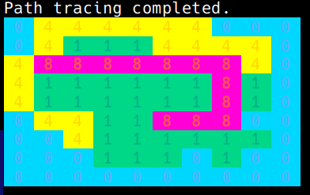
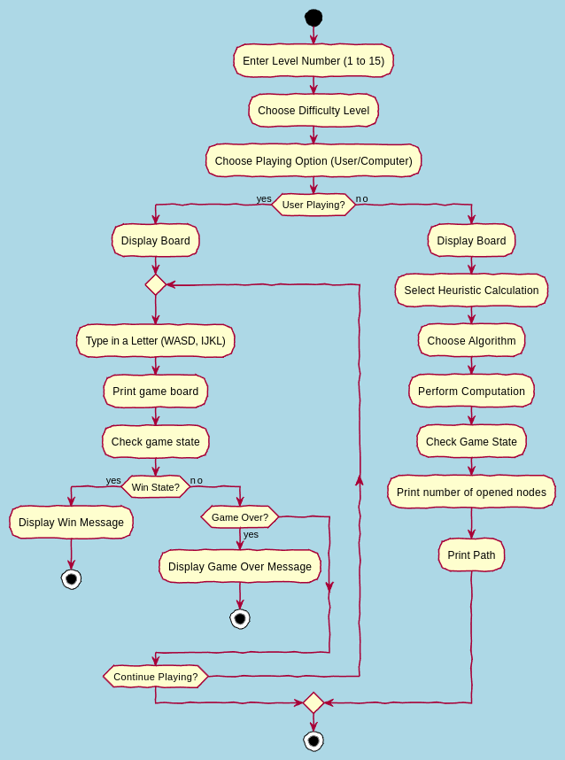
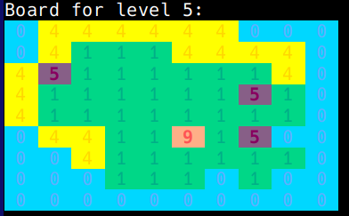

Brainy Warrior
==============

[Brainy Warrior](https://www.coolmathgames.com/0-brainy-warrior) is a puzzle game, the goal of the game is to defeat all enemies, by moving (sliding) towards them, if you don't have an enemy to defeat or a wall to stop you from running, you'll fall right into the water.

**Table of Contents:**

- [**Preview**](#preview)
- [**Game Flow**](#game-flow)
- [**How to Run**](#how-to-run)
    - [Requirements:](#requirements)
    - [Build](#build)
- [**Code Breakdown**](#code-breakdown)
    - [Game Structure](#game-structure)
    - [Movement Functions:](#movement-functions)
    - [Algorithms:](#algorithms)
    - [Heuristics Calculation:](#heuristics-calculation)
    - [Path Retrieval](#path-retrieval)
- [**Resources**](#resources)
- [**Draft of the thinking process**](#draft-of-the-thinking-process)
- [**Future Improvements**](#future-improvements)
- [**Old Looks**](#old-looks)

## Preview

The game is printed on the console, and takes user input from keyboard on game options:

 
<br>
&emsp; 

_In the pictures above_ `5` _is considered a target/ enemy and_ `9` _is the player._

## Game Flow
<!-- 
TODO display a flow chart 
TODO screenshots of user prompts
-->
Below is a flowchart that demonstrates the game flow ([display full size](./screenshot/flowchart.png)):



## How to Run

_Tested on Linux_

### Requirements:

- C++ 17 Compiler
- CMake >= v3.12
- Conan

### Build

Conan package manager and CMake are used for this process, to build the project run the following commands in `./Brainy_Warrior` one by one:
```sh
conan install .
```
```sh
cd build
```
```sh
cmake .. -DCMAKE_TOOLCHAIN_FILE="Release/generators/conan_toolchain.cmake" -DCMAKE_BUILD_TYPE=Release
```
```sh
cmake --build .
```
The C++ code should compile successfully, make sure by starting the game, run the following command (inside `./build` directory):
```sh
./Brainy_Warrior
```

## Code Breakdown

### Game Structure

The game utilizes a 2D board of tiles to maintain state in general. A `Tile` is an object of **{row, col, value}**. A `Board` is a 2D vector of type `Tile`, and `Node_State` is an object of **{Board, Parent, G, H, F}**, used for implementing algorithms.

### Movement Functions:

**canMove-** functions check for walls and edges of the board but they do not consider neighboring sea an invalid move. So they should be used in user movement functions.

**Move** functions operate in the following way:
```
    canMove-()? move-: pop up "invalid move!";
    move-{
        if next is sea: game over!;
        else if next is target: replace target tile;
        else return newBoard;
    }
```
_move_ function only moves one tile at a time.

### Algorithms:

>_**Caution!** any explanation on the algorithms below is specific to my implementation and is not necesserily accurate._

**Breadth-First-Search:**

**BFS** function takes in a _board_, and generates costless states and itarates over them in a queue until _win_ state is met, and maintains an unordered set of stringBoard to avoid revisiting the same node, **stringBoard** is basically the board as a **1D** array of chars put into a string row by row.

**Depth-First-Search:**

**DFS** function also takes in a _board_, the only difference in implementation between DFS and BFS is that it uses a stack to store the generated costless states and _itarates_ over them (not recursivley).

**Uniform-Cost-Search:**

**UCS** implementation is pretty similar to BFS, as it also uses a queue, key difference is that it's a priority queue (min heap), hence, it generates costly states, with a different value for each direction of movement.

**Simple Hill Climbing:**

**Simple Hill Climbing** is very similar to **UCS** except for one key difference, instead of comparing over the g value (cost from start to current node) in the priority queue, we compare over the heuristic value, in the basic implementation I used **Manhattan Distance** formula, **Euclidean** method can also be used but it ignores the movement style in our game.

**A_Star-Search:**

**A\*** or **A_Star** is implemented with a priority queue and an unordered map, key point difference from uniform cost search is that it calculates heuristic and not just cost, there are many methods to achieve A_Star in our game, I chose the simplest one, starting with the closest target and with each movement the closest target is updated.

### Heuristics Calculation:

In main.h there's a global variable that sets the heuristic calculation method based on user input, `distance` function takes two parameters of type `Tile`, `t1` and `t2`, here are the implemented methods so far:

$$
\text{Manhattan} = |x_1 - x_2| + |y_1 - y_2|
$$

```cpp
abs(t1.getRow()-t2.getRow()) + abs(t1.getCol()-t2.getCol());
```
**Euclidean:**
$$
\text{Euclidean} = sqrt{((x_1 - x_2)^2 + (y_1 - y_2)^2)}
$$

```cpp
sqrt((t1.getRow()-t2.getRow())*(t1.getRow()-t2.getRow()) +(t1.getCol()-t2.getCol())*(t1.getCol()-t2.getCol()));
```

### Path Retrieval

To print the final path that the algorithm got from start node to end node (win state), the final state is passed to the `getPath` function, then it checks for player position in each iteration while accessing the parent node of each current node, resulting in this:


&emsp;**[>]**&emsp;

_Pictures above show the path of BFS on level 5_

## Resources

**General:**
- [nlohmann github repository](https://github.com/nlohmann/json)
- [ANSI escape code](https://en.wikipedia.org/wiki/ANSI_escape_code)
- [Working with Conan and CMake](https://www.codeproject.com/Articles/5385907/Managing-Cplusplus-Projects-with-Conan-and-CMake)

**Algorithms:**
- [A* (A-Star) algorithm](https://en.wikipedia.org/wiki/A*_search_algorithm)
- [A* by Patrick Lester](https://web.archive.org/web/20051230012332/https://www.policyalmanac.org/games/aStarTutorial.htm)
- [Hill Climbing in AI](https://www.geeksforgeeks.org/introduction-hill-climbing-artificial-intelligence/)

**Worth Reading papers:**
- [Multi-Target Pathfinding: Evaluating A-star Versus BFS](http://mau.diva-portal.org/smash/get/diva2:1897067/FULLTEXT02.pdf)

## Draft of the thinking process

  

## Future Improvements

There are various ways to improve the game which is currently under construction:

- Make TUI, using ncurses possibly.
- Optimize time complexity of computer playing
- Implement levels with wizard (above 5 on the original game website)
- Track score for players based on name, and number of steps
- Improve the experience on the console

## Old Looks

   