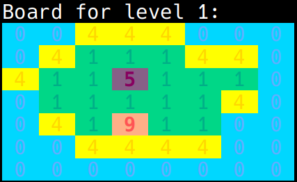
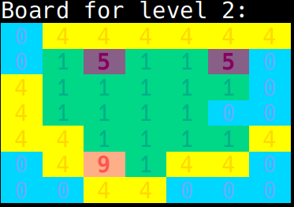
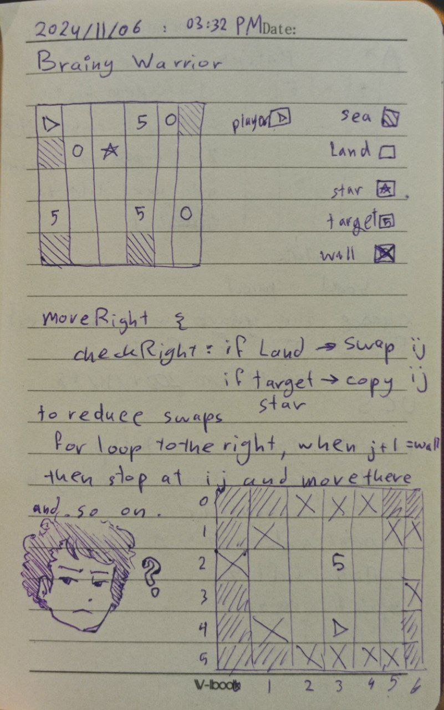
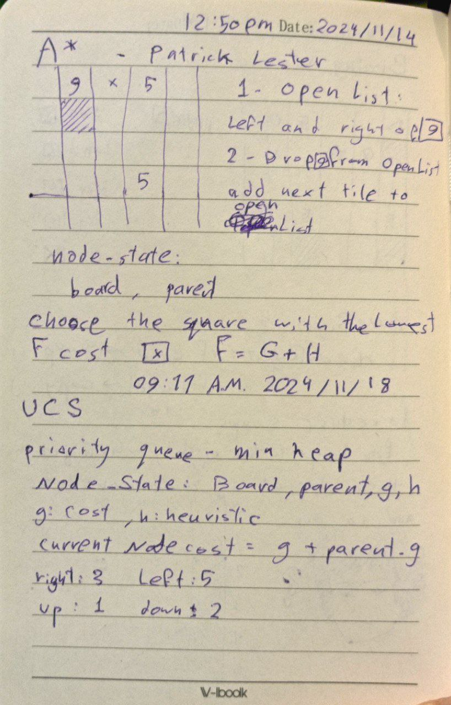
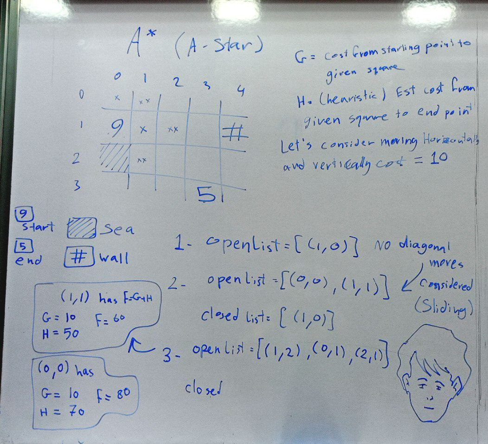
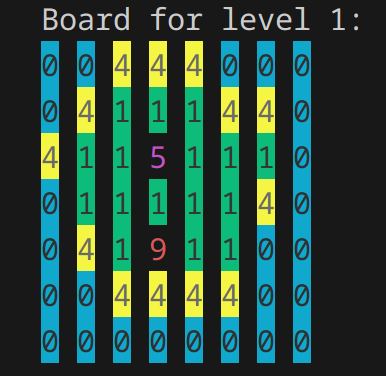
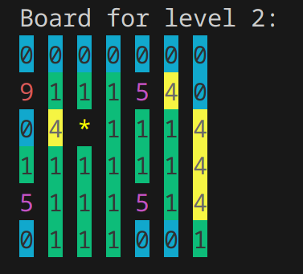
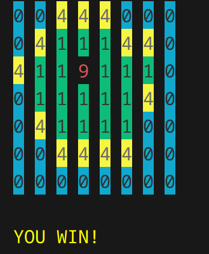
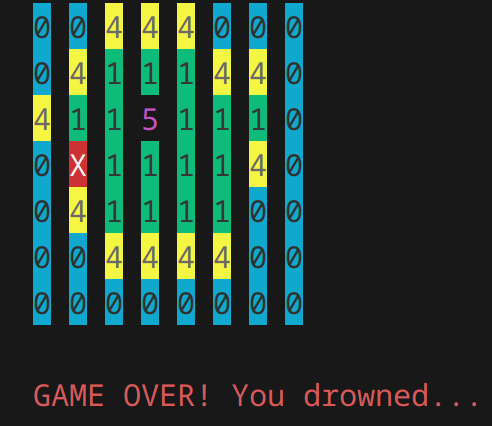

Brainy Warrior
==============

[Brainy Warrior](https://www.coolmathgames.com/0-brainy-warrior) is a puzzle game, the goal of the game is to defeat all enemies, by moving (sliding) towards them, if you don't have an enemy to defeat or a wall to stop you from running, you'll fall right into the water.

**Table of Contents:**
- [Preview](#preview)
- [Game Structure](#game-structure)
- [Game Flow](#game-flow)
- [How to Run](#how-to-run)
- [Code Breakdown](#code-breakdown)
- [Resources](#resources)
- [Draft of the thinking process](#draft-of-the-thinking-process)
- [Future Improvements](#future-improvements)

## Preview

The game is printed on the console:

 
<br>
 

_In the picture above_ `5` _is considered a target/ enemy and_ `9` _is the player._

## Game Structure

The game structure is split into folders for clean and easy maintnance, under `src` folder there exists: `structure` folder, which contains board.cpp, tile.cpp...etc.

While `logic` folder contains the functionalities for the game to run, which make the user able to play the game.

And finally, `game_solver` folder, which contains some algorithms that solve some levels of the game, such as BFS, DFS, A_Star and more.

## Game Flow
<!-- 
TODO display a flow chart 
TODO screenshots of user prompts
-->

The game starts with a prompt asking the the user: `Enter a level number between 1 and 6:`, then the user chooses to either play the game themself or let the computer play it.

**IF** the user chose to play it, they're asked to choose difficulty level: Easy mode, and Hard mode, easy mode is basically moving tile by tile, hard mode is sliding over the board.

**ELSE IF** they chose the computer to play it, they choose between available algorithms.

## How to Run

_Tested on Linux_

### Depnedencies:

Conan package manager and CMake are used for this process, to build the project run the following commands in `./Brainy_Warrior` one by one:
```sh
conan install .
```
```sh
cd build
```
```sh
cmake .. -DCMAKE_TOOLCHAIN_FILE="Release/generators/conan_toolchain.cmake" -DCMAKE_BUILD_TYPE=Release
```
```sh
cmake --build .
```
The C++ code should compile successfully, make sure by starting the game, run the following command (inside `./build` directory):
```sh
./Brainy_Warrior
```

## Code Breakdown

### Movement functions:

**canMove-** functions check for walls and edges of the board but they do not consider neighboring sea an invalid move. So they should be used in user movement functions.

**Move** functions operate in the following way:
```
    canMove-()? move-: pop up "invalid move!";
    move-{
        if next is sea: game over!;
        else if next is target: replace target tile;
        else return newBoard;
    }
```
_move_ function only moves one tile at a time.

### Algorithms:

**Breadth-First-Search:**

**BFS** function takes in a _board_, and generates costless states and itarates over them in a queue until _win_ state is met, and maintains an unordered set of stringBoard to avoid revisiting the same node, **stringBoard** is basically the board as a **1D** array of chars put into a string row by row.

**Depth-First-Search:**

**DFS** function also takes in a _board_, the only difference in implementation between DFS and BFS is that it uses a stack to store the generated costless states and _itarates_ over them (not recursivley).

**Uniform-Cost-Search:**

**UCS** implementation is pretty similar to BFS, as it also uses a queue, key difference is that it's a priority queue (min heap), hence, it generates costly states, with a different value for each direction of movement.

**Simple Hill Climbing:**

**Simple Hill Climbing** is very similar to **UCS** except for one key difference, instead of comparing over the g value (cost from start to current node) in the priority queue, we compare over the heuristic value, in the basic implementation I used **Manhattan Distance** formula, **Euclidean** method can also be used but it ignores the movement style in our game.

**A_Star-Search:**

**A\*** or **A_Star** is implemented with a priority queue and an unordered map, key point difference from uniform cost search is that it calculates heuristic and not just cost, there are many methods to achieve A_Star in our game, I chose the simplest one, starting with the closest target and with each movement the closest target is updated.

### Heuristics Calculation:

In main.h there's a global variable that sets the heuristic calculation method based on user input, `distance` function takes two parameters of type `Tile`, `t1` and `t2`, here are the implemented methods so far:

**Manhattan:**
```cpp
abs(t1.getRow()-t2.getRow()) + abs(t1.getCol()-t2.getCol());
```
**Eculidean:**
```cpp
sqrt((t1.getRow()-t2.getRow())*(t1.getRow()-t2.getRow()) +(t1.getCol()-t2.getCol())*(t1.getCol()-t2.getCol()));
```
## Resources

- [nlohmann github repository](https://github.com/nlohmann/json)
- [ANSI escape code](https://en.wikipedia.org/wiki/ANSI_escape_code)
- [Working with Conan and CMake](https://www.codeproject.com/Articles/5385907/Managing-Cplusplus-Projects-with-Conan-and-CMake)
- [A* (A-Star) algorithm](https://en.wikipedia.org/wiki/A*_search_algorithm)
- [A* by Patrick Lester](https://web.archive.org/web/20051230012332/https://www.policyalmanac.org/games/aStarTutorial.htm)
- [Hill Climbing in AI](https://www.geeksforgeeks.org/introduction-hill-climbing-artificial-intelligence/)

## Draft of the thinking process

  

## Future Improvements

There are various ways to improve the game which is currently under construction:

- Make TUI, using ncurses possibly.
- Improve the looks of the console version
- Optimize time complexity of computer playing
- Implement levels with wizard (above 5 on the original game website)

## Old looks

   